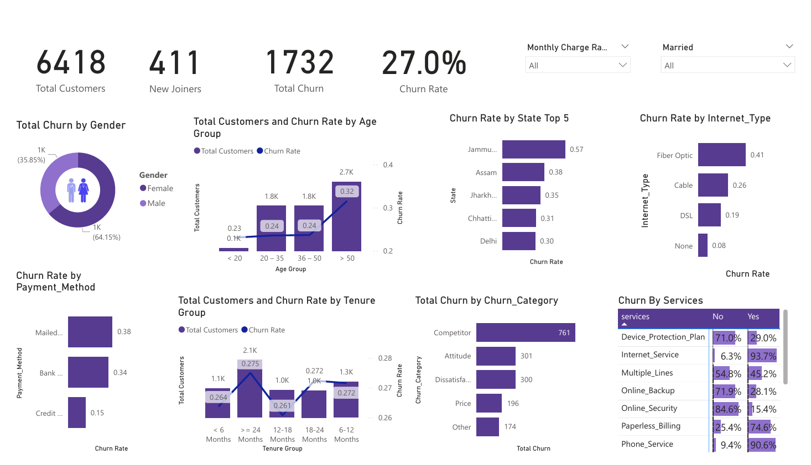

# Churn Analysis Project

## Problem Statement
In today’s competitive business environment, retaining customers is crucial for long-term success. **Churn analysis** is a key technique used to understand and reduce customer attrition. It involves examining customer data to identify patterns and reasons behind customer departures.

---

## Target Audience
Although this project focuses on churn analysis for a telecom firm, the techniques and insights are applicable across various industries. From **retail and finance to healthcare and beyond**, any business that values customer retention can benefit from churn analysis.

---

## Technologies Used
- **SQL Server**: ETL processes, data cleaning, and preparation.
- **Power BI**: Data transformations, interactive dashboards, and visualizations.
- **Python**: Machine learning model development (Random Forest) in Jupyter Notebook.

---

## Project Workflow

1. **ETL Process in SQL Server**
   - Extract, Transform, and Load (ETL) process to gather customer data from multiple sources.
   - Data integration and preparation for analysis.

2. **Data Cleaning in SQL Server**
   - Handle missing values, duplicate records, and inconsistent data.
   - Generate clean datasets ready for analysis and modeling.

3. **Power BI Transformations**
   - Apply additional transformations on imported data for reporting.
   - Use Power Query to shape the dataset.

4. **Power BI Visualization & Enhancing Visuals**
   - Create interactive dashboards to visualize key metrics.
   - Enhance visuals with slicers, charts, and KPIs for better insights.

5. **Build Machine Learning Model in Python**
   - Use **Random Forest** classifier to predict customer churn.
   - Feature engineering, model training, and evaluation performed in **Jupyter Notebook**.

6. **Visualize Predicted Data in Power BI**
   - Import predicted churn results into Power BI.
   - Create dashboards to visualize the **Predicted Churner Profile** and other insights.

---



---
## Key Insights
- Analyzed **6,418 total customers** and identified **1,732 churn cases**, highlighting a **27% churn rate**.  
- **64% of churn** came from male customers, while females contributed **36%**.  
- **High churn in customers aged >50 years** (32%), compared to 24% in the 20–50 age range.  
- **Fiber Optic internet users** are the highest-risk group with **41% churn**, vs. 19% for DSL and only 8% for customers without internet.  
- **Mailed payment users churned at 38%**, compared to 15% for credit card users.  
- **Competitor-driven churn** (761 cases) is the largest reason, followed by attitude (301) and dissatisfaction (300).  
- **Churn by tenure analysis** revealed new customers (<6 months) churned at 26.4%, while long-term customers (≥24 months) had the highest churn at 27.5%.  
- **Service-based churn drivers**:  
  - 93.7% churners had internet services.  
  - 74.6% used paperless billing.  
  - 45.2% had multiple lines, showing bundled services do not always reduce churn.

---

## How to Use
1. Clone the repository:

```bash
git clone https://github.com/yourusername/churn-analysis.git
